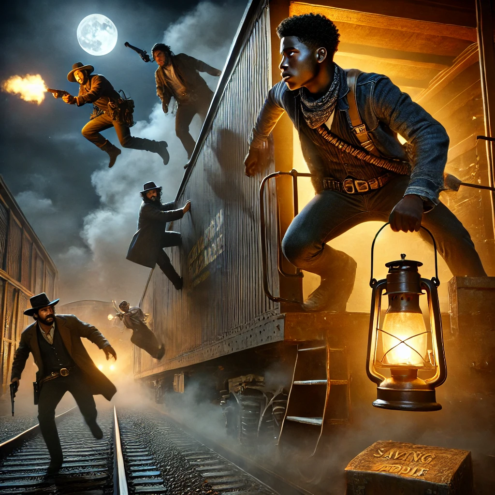

# 프롤로그: 아버지의 농장

## 새벽녘의 어둠

미시시피 강의 물안개가 농장 위를 감싸고 있었다. 거대한 대지 한복판에 자리 잡은 농장 집은 푸르스름한 새벽빛 속에서 위엄을 뽐냈다. 이곳은 백인 농장주들이 자랑하는 번영의 상징이었다. 그러나 그 번영의 무게는 검은 손과 등에 의해 지탱되고 있었다. 스튜어트는 창가에 앉아 먼 동이 트는 풍경을 바라보며 한숨을 내쉬었다. 그의 피부는 아버지처럼 흰빛을 띠지 않았지만, 그가 가진 성실함과 재능은 아버지의 혈통을 고스란히 물려받았다.

그는 아버지, 제임스 랜돌프를 깊이 사랑했다. 하지만 그 사랑은 공공연히 말로 표현할 수 없는 것이었다. 아버지는 그를 ‘럭키 키즈(Lucky Kid)’라고 부르며 사랑으로 키웠지만, “아빠”라는 단어는 집안 어디에서도 허락되지 않았다. 그 이유는 간단했다. 스튜어트의 어머니가 노예였기 때문이다.

## 아버지의 고뇌

제임스 랜돌프는 독실한 기독교 신자이자, 고지식한 남부 농장주였다. 그는 어릴 적부터 성경을 손에 들고 자랐고, 모든 사람이 신 앞에서 평등하다는 가르침을 가슴속 깊이 새겼다. 하지만 사회는 그에게 다른 요구를 했다. 백인 지주로서 그는 노예를 소유해야 했고, 이웃 농장주들과의 연대를 위해 노예제도의 수혜자가 되어야 했다.

스튜어트가 태어났을 때, 제임스는 처음으로 자신의 신념과 현실 사이의 괴리를 절감했다. 아내로 여길 수 없었던 스튜어트의 어머니는 아들의 존재를 부끄러워하지 않았지만, 그 사회적 압력은 그녀를 침묵하게 만들었다. 제임스는 자신의 아들을 부정할 수 없었다. 그는 스튜어트를 교육시켰고, 피아노와 사격을 가르쳤으며, 라틴어 성경 구절을 암송하게 했다.

그러나 농장 밖에서의 현실은 잔혹했다. 백인 이웃들은 스튜어트를 제임스의 친자로 인정하기는커녕 노예와 백인 사이의 치욕적인 혼혈아로 취급했다. “내 아버지입니다”라는 말은 스튜어트의 입술에 닿지도 못했다. 그것은 이 마을에서 그의 존재를 부정당하는 일이 될 터였다.

## 치욕과 도전

어느 날, 스튜어트는 말목장에서 일하는 백인 일꾼들과 충돌했다. 평소 그를 깔보던 일꾼들이 말 가죽 벗기는 작업을 하다 일부러 일을 늦춘 것처럼 꾸며 스튜어트를 꾸짖었다. 스튜어트는 한두 번 참았지만, 결국 참다못해 일꾼에게 정면으로 맞섰다. “나는 네가 무시할 사람이 아니야. 내 피에 대해 네가 아무리 욕을 해도, 나는 내 삶을 네가 평가하지 못하게 만들 거야!”

그 순간, 백인 일꾼 중 하나가 허리에 찬 리볼버를 뽑아 들었다. 농장의 마당 한복판에서 피비린내 나는 일이 벌어질 수도 있었다. 하지만 스튜어트는 누구도 예상치 못한 속도로 그의 손목을 붙잡았다. 한 번의 간결한 움직임으로 총을 빼앗아 단숨에 방아쇠를 제거했다. “이건 너희가 나를 두려워해야 하는 이유야.” 그의 눈에는 서늘한 결단이 서려 있었다.

## 아버지와의 포옹

그날 저녁, 스튜어트는 아버지에게 불려갔다. 제임스는 깊은 주름이 패인 얼굴로 스튜어트를 바라보았다. 그는 한숨을 쉬며 말을 꺼냈다. “너는 이곳에서 오래 머물 수 없다. 내가 너를 사랑하고, 네가 나의 아들이라는 사실은 변하지 않아. 하지만 이 마을, 이 세상은 너를 용납하지 않을 것이다. 내가 너를 보호할 수도 없다.”

스튜어트는 눈물을 삼키며 아버지에게 물었다. “왜 제가 아버지를 아버지라고 부를 수 없나요?” 제임스는 무거운 표정으로 대답했다. “내가 약하기 때문이다, 아들아. 세상이 두렵고, 내가 가진 것이 모두 무너질까 두렵다. 하지만 이제 너는 떠나야 한다. 너 자신만의 세상을 만들어야 한다.”

제임스는 눈시울을 붉히며 스튜어트를 안았다. “나는 네가 자랑스럽다. 내 럭키 키즈(Lucky Kid).” 그 말을 듣는 순간, 스튜어트의 마음속에서는 복잡한 감정들이 뒤섞였다. 그는 자신의 운명을 받아들이기로 결심했다.

## 출발

그날 밤, 스튜어트는 자신의 물건을 말에 묶고 집을 떠났다. 아버지는 현관에 서서 그가 멀어지는 것을 지켜보았다. 고요한 밤하늘 아래, 스튜어트는 자신의 인생에서 두 번째로 단단히 맹세했다. “내가 아버지의 자랑스러운 아들임을 증명할 거야. 내 방식대로.”

# 챕터 1: 황야의 첫 걸음

## 끝없는 황야

태양은 사막의 모래 위에서 반짝였고, 바람은 아무런 냄새도 없는 먼지를 뿌렸다. 스튜어트는 물통을 확인하며 한 모금의 물도 낭비하지 않으려 노력했다. 떠난 지 일주일이 지나자 그의 몸은 피곤에 찌들었고, 입술은 바싹 말라 있었다. 그러나 그의 마음속에는 두 가지 감정이 공존했다. 자유에 대한 설렘과 다가올 날들에 대한 불안. 그는 아버지의 농장을 떠나며 자신만의 삶을 찾아 떠났지만, 그 여정이 이렇게 혹독할 줄은 몰랐다.

스튜어트는 멀리 보이는 황량한 산맥을 바라보며 길을 잡았다. 그곳에는 아버지의 농장과 같은 억압적인 현실에서 벗어나, 새로운 세계가 기다리고 있을 것 같았다. 그는 매일 밤 성경 구절을 읊조리며 자신의 의지를 다잡았다. “하나님은 나를 버리지 않으실 것이다.” 그러나 현실은 신의 축복만으로 살아갈 수 없는 곳이었다.

## 강도들과의 첫 만남

어느 날, 스튜어트는 오랜만에 물을 구하기 위해 작은 강가에 들렀다. 물병을 채우고 쉬고 있던 그는, 갑자기 자신의 등 뒤에서 들려오는 웃음소리를 들었다. 그는 고개를 돌려보았다. 세 명의 남자가 그를 둘러싸고 있었다. 그들의 눈빛은 경멸과 탐욕으로 가득했다.

“이리 귀한 여행객을 만날 줄은 몰랐네,” 한 남자가 비웃으며 말했다. 그는 큰 덩치에 더러운 가죽 조끼를 입고 있었다. “여행 경비는 얼마나 들었는지 좀 확인해봐야겠어.” 그는 스튜어트의 허리띠에 찬 권총을 가리키며 손을 내밀었다.

스튜어트는 잠시 두려움을 느꼈지만, 아버지에게 배운 대로 차분하게 대응했다. 그는 손을 들어 보이며 천천히 말을 꺼냈다. “여기에는 줄 것이 없다. 너희가 얻을 것도 없을 것이다.” 그의 말투는 결연했지만, 상대는 더 큰 웃음으로 받아쳤다.

“너희 같은 놈들은 항상 말이 많지,” 덩치 큰 남자가 그의 턱을 들어 올리며 말했다. 그러자 또 다른 남자가 뒤에서 스튜어트를 덮쳤다. 하지만 스튜어트는 준비가 되어 있었다. 그는 몸을 돌려 날렵한 동작으로 남자를 넘어뜨리고, 그의 권총을 뺏어들었다. 놀란 강도들은 당황했지만, 스튜어트는 그들을 죽이는 대신 말했다.

“여기서 떠나라. 다시는 이런 짓을 하지 말고.” 강도들은 겁에 질려 도망쳤다. 그 순간, 그는 자신이 처음으로 완전히 홀로 서 있다는 사실을 깨달았다. 그리고 그 자유의 무게를 어깨에 짊어졌다.

## 첫 동료와의 만남

며칠 후, 스튜어트는 작은 마을의 술집에서 잠시 쉬기로 했다. 그곳은 먼지와 연기로 가득 찬 서부의 흔한 술집이었다. 그는 바에서 물 한 잔을 주문하고 조용히 앉아있었다. 그때, 그의 옆자리에서 싸움이 벌어졌다. 작은 체구의 남자가 거대한 아이리시 사내에게 맞서고 있었다.

“네 놈은 항상 다른 사람들의 것을 훔치려 하지!” 아이리시 사내가 소리쳤다. 그는 거대한 손으로 상대를 붙잡고 있었지만, 작은 체구의 남자는 지지 않고 발버둥쳤다.

스튜어트는 그 광경을 보고 망설였다. 개입하는 것이 옳은 일일까? 그러나 그는 곧 일어섰다. “그만둬라. 두 사람 모두 이 싸움으로 얻는 게 없을 것이다.” 그의 말은 냉정하면서도 단호했다.

아이리시 사내는 스튜어트를 흘겨보았다. “네가 뭔데 끼어드느냐?”

“나는 그냥 지나가는 여행자일 뿐이다. 하지만 내가 볼 때, 너희 둘 다 더 나은 해결 방법을 찾을 수 있을 것이다.”

그 순간, 작은 체구의 남자가 외쳤다. “그가 맞아! 우리가 싸울 이유는 없지 않나?” 그는 스튜어트의 제안을 받아들였다. 결국, 두 사람은 술잔을 부딪치며 화해했다. 아이리시 사내는 스튜어트에게 고마움을 표하며 자신의 이름이 패디라고 소개했다.

“네가 괜찮은 놈인 것 같다. 나랑 같이 다니는 건 어떠냐?” 패디는 스튜어트를 바라보며 말했다. 그는 자신이 뒷골목에서나 살아왔지만, 스튜어트의 단호함과 의로움을 존경했다. 스튜어트는 잠시 생각하다가 고개를 끄덕였다. “같이 가자. 길이 길면 동료가 필요한 법이지.”

## 세이빙 피플 클랜의 시작

그 이후로 스튜어트는 여러 사람들과 만나게 되었다. 히스패닉 도적 호세, 아메리카 원주민 추적자 레드 울프, 그리고 중국계 기술자 리엔. 각기 다른 배경과 이유로 스튜어트의 여정에 합류한 이들은 한 가지 공통점을 공유했다. 모두가 그들만의 정의를 찾고 있었다.

그들은 서서히 서부의 억압받는 이들을 돕기 시작했다. 부당한 세금을 걷는 관리에게서 농민을 지켜내고, 악덕 농장주로부터 가족을 구해냈다. 그 과정에서 그들은 자신들만의 이름을 가지게 되었다. “세이빙 피플 클랜.” 그들은 서부 전역에서 핍박받는 사람들에게 전설로 불리기 시작했다.

스튜어트는 그들의 리더로서, 자신의 길이 단순히 생존의 여정이 아니라 더 큰 목적을 가진 사명이 되어가고 있음을 깨달았다. 이제 그는 아버지의 “럭키 키즈”가 아닌, 자신의 이야기를 만들어가는 사람이었다.

# 챕터 2: 현상금 사냥꾼들

## 전설이 퍼지다

세이빙 피플 클랜의 이름은 황야의 구석구석까지 퍼져나갔다. 노예 농장의 노예들이 사슬을 끊고 달아나 그들의 이름을 속삭였다. 농민들은 그들이 지나가는 길목에 숨어서 손을 흔들었고, 아이들은 그들의 이야기를 들으며 희망을 품었다. 그러나 그 명성은 단지 약자들에게만 닿은 것이 아니었다. 세이빙 피플 클랜의 활동은 농장주와 관리들, 그리고 서부를 쥐고 흔드는 악덕 기업가들의 눈에 가시처럼 박히기 시작했다.

“이런 자들은 오래두지 못한다.” 어느 한 농장주의 연회장에서 와인을 홀짝이며 고급 양복을 입은 사내가 말했다. 그는 농장주들에게 이렇게 선언했다. “내가 돈을 대겠다. 저 악질들을 잡아들이는 현상금을 걸도록 하지.”

얼마 지나지 않아 서부 전역의 술집과 우체국, 보안관 사무소의 벽에는 한 장의 포스터가 붙었다. 거기에는 스튜어트와 그의 동료들의 얼굴이 대충 그려져 있었고, 아래에는 이렇게 적혀 있었다.

“현상수배: 세이빙 피플 클랜 – 살아있든 죽었든, 5000달러.”

## 사냥꾼들의 발자취

스튜어트와 동료들은 여느 날과 다름없이 한 농장을 돕고 있었다. 그 농장은 서부의 거대 기업이 부당하게 세금을 부과하여 농민들을 길바닥으로 몰아내려던 곳이었다. 클랜은 교활한 방법으로 세금을 걷으러 온 관리들의 마차를 뒤엎고, 그 안에 든 문서를 불태웠다. 농민들은 눈물을 흘리며 그들에게 감사를 표했다.

하지만 이내, 패디가 급하게 말을 몰고 돌아왔다. “우리 뒤를 쫓는 놈들이 있어. 그들은 현상금 사냥꾼들 같아.”

호세가 능숙하게 칼을 다듬으며 말했다. “우리를 노리는 자들이라면 쉽게 넘어오진 않겠지.”

레드 울프는 말을 타고 언덕 위로 올라가 먼발치의 움직임을 살폈다. “그들은 경험이 많은 사냥꾼들이다. 우리가 뭉쳐 있다는 걸 알고, 포위하려는 듯 하다.”

스튜어트는 짧게 한숨을 쉬며 결단을 내렸다. “숫자로 밀리는 싸움은 우리가 원하는 게 아니다. 하나하나 처리하자. 전략적으로 움직여야 한다.”

## 황야의 첫 매복

사냥꾼들은 예상대로 자신들이 유리한 환경, 즉 황량한 협곡을 선택했다. 그곳은 바위가 많고 탈출이 쉽지 않은 지형이었다. 그러나 스튜어트는 그들의 의도를 간파하고 있었다.

“리엔, 너의 기술을 보여줄 때다.” 스튜어트가 말하자, 리엔은 가죽 가방에서 다이너마이트를 꺼냈다. 그는 협곡의 좁은 길목에 함정을 설치했고, 모든 것이 준비된 후 클랜은 일부러 흔적을 남기며 사냥꾼들을 그곳으로 유인했다.

사냥꾼들의 리더인 제드라는 사내는 흔적을 따라 협곡 안으로 말을 몰았다. 그의 뒤에는 사냥꾼들 약 열 명이 따르고 있었다. 그들은 서로 교신하며 “이번에야말로 저놈들을 잡자!”고 소리쳤다.

그러나 협곡의 중간에 다다랐을 때, 리엔이 숨어있던 바위 뒤에서 신호를 보냈다. 스튜어트는 빠르게 다이너마이트 심지에 불을 붙였다. 거대한 폭발음과 함께 바위들이 굴러 떨어져 협곡 입구를 막아버렸다. 사냥꾼들은 당황하며 뒷걸음질 쳤다.

그 순간, 클랜이 협곡 위쪽에서 나타나 그들을 포위했다. 스튜어트는 리볼버를 꺼내들고 제드에게 외쳤다. “무기를 내려놔라. 이건 너희가 이길 싸움이 아니다.”

제드는 이를 악물고 스튜어트를 노려보며 말했다. “우리의 목숨값이 얼마인지 알고 있나? 5000달러면 너희를 팔고 황야를 떠날 수 있어.”

스튜어트는 단호한 목소리로 말했다. “그 돈으로 너희가 행복할 거라 생각하나? 사람들을 억압하고 죽음의 대가로 사는 삶은 너희도 언젠가 끝내야 할 것이다.”

제드는 잠시 머뭇거리더니, 결국 총을 내려놓았다. 다른 사냥꾼들도 그를 따라 무기를 내려놓았다. 클랜은 그들을 묶어 근처 보안관 사무소로 데려갔다. 그곳의 보안관은 현상금 사냥꾼들이 포획된 것을 보고 당황했지만, 스튜어트와 클랜이 흘끗 그의 배지를 쳐다보자 순순히 받아들였다.

## 새로운 위협

그날 밤, 클랜은 작전이 성공적으로 끝난 것을 자축하며 조용히 모닥불을 피우고 있었다. 그러나 스튜어트는 계속해서 불길한 예감에 사로잡혀 있었다. “우리가 이렇게까지 유명해지는 게 좋은 일이 아닐지도 몰라.”

패디는 낄낄거리며 말했다. “유명세가 없으면 우린 그냥 도적떼처럼 보일 뿐이야. 오히려 사람들이 우리를 기억해준다면, 우리가 더 많은 일을 할 수 있지.”

스튜어트는 그의 말을 듣고 고개를 끄덕였지만, 마음속 깊은 곳에는 여전히 무언가가 찜찜했다. 그리고 그의 예감은 곧 적중하게 될 터였다. 현상금 사냥꾼들은 단지 시작일 뿐이었다. 그들의 활동은 더 큰 세력, 바로 철도 회사와 악덕 기업가의 직접적인 관심을 끌고 있었던 것이다.

# 챕터 3: 고향의 위기

## 고향에서 온 소식

스튜어트는 황야 한가운데서 흩날리는 먼지를 바라보며 깊은 생각에 잠겨 있었다. 그의 곁에서 호세는 말 안장을 정리하고 있었고, 패디는 모닥불 위에서 콩 통조림을 데우고 있었다. 리엔은 새롭게 얻은 도구를 만지작거리며 뭔가를 만들고 있었지만, 스튜어트는 그 순간 모든 소리를 잊고 있었다.

갑작스러운 말발굽 소리가 침묵을 깨뜨렸다. 먼지가 일며 다가오는 것은 피곤해 보이는 한 노인이었다. 그는 스튜어트를 알아보고 한쪽 손을 흔들며 외쳤다. “스튜어트! 네가 맞느냐?”

스튜어트는 일어나 그의 말을 잡아주었다. 노인은 숨을 몰아쉬며 말했다. “너의 고향 마을에 문제가 생겼다. 철도 회사가 그곳에 역을 세우려 하고 있어. 하지만 그곳은 단순히 역을 세우는 게 아니야. 그들이 대통령을 죽이려는 음모가 있다네!”

스튜어트는 깜짝 놀라며 물었다. “철도 회사가? 그리고 대통령을 죽인다고?”

노인은 마른 입술을 축이며 설명했다. “철도 회사 뒤에 있는 큰 기업가가 있어. 그는 노예제 폐지를 주장하는 대통령이 눈엣가시인 모양이야. 이번에 고향 마을에서 열리는 철도 개통식에 대통령이 방문할 예정인데, 거기서 암살 계획을 실행하려고 해.”

스튜어트는 입술을 꽉 물었다. 고향을 떠난 지 오래였지만, 그곳은 여전히 그의 마음속에 있었다. 그리고 아버지의 얼굴이 순간 떠올랐다. 고향을 떠나기 전, 아버지가 그에게 했던 말이 귓가에 맴돌았다. “네가 세상을 바꿀 수 없다면, 세상이 너를 삼켜버릴 것이다.”

## 철도 회사의 음모

스튜어트는 클랜을 소집했다. 그는 상황을 설명하며 동료들에게 물었다. “너희가 나를 도와줄 수 있겠나? 고향 마을로 돌아가야 한다. 하지만 위험은 클 것이다.”

호세가 먼저 말했다. “너를 두고 어디로 가겠어? 우린 함께 싸우기로 하지 않았나.”

패디와 레드 울프도 고개를 끄덕였고, 리엔은 그의 가방을 열어 새로운 폭발 장치를 보여주며 미소 지었다. “준비는 되어 있어.”

클랜은 즉시 움직였다. 그들은 노인의 도움으로 철도 회사의 계획에 대해 더 자세히 알게 되었다. 기업가는 철도 회사의 자본을 이용해 지역 정치인들과 군인을 매수하고, 대통령의 암살 계획까지 세우고 있었다. 그 음모는 치밀하고 위험했다. 대통령의 측근 몇몇도 이미 매수되어 있었고, 기업가가 마을에서 금과 현금을 옮기는 전용 열차를 사용해 음모의 흔적을 숨기고 있었다.

## 열차 습격

스튜어트는 클랜과 함께 기업 전용 열차를 습격하기로 계획을 세웠다. 그 열차에는 기업가가 모은 막대한 부와 함께 대통령 암살 계획에 필요한 문서들이 숨겨져 있었다. 목표는 명확했다. 그 문서들을 손에 넣고, 그들의 음모를 막는 것.

열차는 어두운 밤, 황야를 가로지르고 있었다. 스튜어트와 동료들은 말 위에서 바람 소리를 들으며 움직였다. 리엔이 준비한 폭발 장치를 철로 옆에 설치하자, 스튜어트가 신호를 보냈다.

“시작한다.”

굉음과 함께 폭발이 일어났고, 열차가 급정거하며 덜컹거렸다. 기업가의 경비원들이 총을 들고 밖으로 나왔지만, 이미 클랜은 각자의 자리에서 움직이고 있었다. 패디와 호세는 교묘한 움직임으로 경비원들의 주의를 끌었고, 레드 울프는 날렵하게 기차 위로 올라가 뒤쪽에서 경비원을 처리했다.

스튜어트는 리엔과 함께 화물칸으로 들어갔다. 그곳에는 금괴와 현금이 가득했다. 그러나 스튜어트의 눈길을 사로잡은 것은 금고 안에 숨겨져 있던 문서였다. 그는 그것을 열어보고 깊은 충격에 빠졌다.

## 암살 계획의 전말

문서에는 대통령 암살 계획이 적혀 있었다. 암살은 개통식 연설 도중 저격수가 대통령을 쏘는 방식으로 이루어질 예정이었다. 기업가는 또한 혼란을 틈타 미국 정부의 주요 인사들에게 영향력을 확대하려는 계획까지 세우고 있었다.

스튜어트는 이를 보며 분노를 삼켰다. “이건 단순히 고향의 문제가 아니다. 이건 국가의 문제야. 그들이 이 계획을 성공시키면 더 많은 사람들이 고통받을 것이다.”

그는 동료들에게 말했다. “나는 고향으로 돌아간다. 이 계획을 막아야 한다. 하지만 너희가 위험을 감수할 필요는 없다.”

패디는 크게 웃으며 말했다. “우리가 너를 도와준 게 몇 번인데, 이제 와서 빠지라고? 가자, 고향으로.”

클랜은 서둘러 고향 마을로 향했다. 그들의 가슴은 뜨거웠고, 그들의 결심은 더 강해졌다. 그러나 고향에 도착한 순간, 스튜어트는 이미 보안관이 자신을 기다리고 있다는 사실을 깨달았다.

## 붙잡히다

고향 마을은 평온해 보였지만, 그 속에는 음모가 숨어 있었다. 스튜어트와 동료들이 마을에 들어서자마자 보안관과 그의 부하들이 그들을 둘러쌌다. 보안관은 스튜어트를 보며 냉소적으로 말했다. “네가 돌아올 줄 알았다. 너 같은 문제아들은 항상 스스로를 곤경에 빠뜨리거든.”

스튜어트는 저항하지 않았다. 그는 동료들에게 눈짓하며 말을 건넸다. “내가 시간을 벌게. 너희는 계획을 실행해라.”

그는 곧바로 감옥으로 끌려갔고, 기업가가 직접 감옥을 방문했다. 기업가는 비웃으며 말했다. “네가 아무리 애를 써도 아무것도 바뀌지 않는다. 넌 단지 노예의 아들일 뿐이야.”

그러나 스튜어트의 눈빛에는 흔들림이 없었다. “우린 그보다 더 강하다. 넌 곧 알게 될 것이다.”

# 챕터 4: 결단

## 감옥의 고독

감옥은 차가웠고, 어둠 속에서는 들쥐들이 스쳐 지나가는 소리가 들렸다. 스튜어트는 쇠사슬에 묶인 채 바닥에 앉아 있었다. 두 손은 묶였고, 입술에는 피가 묻어 있었다. 보안관은 그를 심문하며 매섭게 몰아붙였지만, 스튜어트는 입을 열지 않았다. 그가 쏟아낸 모욕과 협박은 마치 바람처럼 스쳐 지나갔다.

고문이 끝난 후, 스튜어트는 홀로 남겨졌다. 그는 상처투성이의 몸으로 차가운 감방 바닥에 기대어 숨을 몰아쉬었다. 그의 눈앞에는 어릴 적의 기억이 떠올랐다. 아버지의 농장에서 겪었던 굴욕, 백인 아이들에게 괴롭힘을 당하며 느꼈던 분노, 그리고 아버지의 따뜻한 품속에서 들었던 위로의 말.

“스튜어트, 세상이 너를 어떻게 대하든, 하느님은 너를 보고 계신다. 너는 나의 ‘럭키 키즈’야. 그리고 언젠가 네가 옳은 일을 하게 될 거라는 걸 믿는다.”

아버지의 목소리가 그의 마음속 깊은 곳에서 메아리쳤다. 그는 눈을 감고 그 말을 되새기며 자신을 다잡았다. “나는 여기서 멈출 수 없다. 아버지와 나 자신을 위해서라도.”

## 동료들의 작전

감옥 밖에서는 스튜어트의 동료들이 그를 구출하기 위한 계획을 세우고 있었다. 레드 울프는 감옥 구조를 정찰하며 철저히 지형을 파악했다. “남쪽 벽은 약하다. 거기에 리엔의 장치를 쓰면 벽을 무너뜨릴 수 있을 것이다.”

패디는 웃으며 말했다. “그리고 내가 보안관의 부하들을 끌어내면, 호세가 처리할 차례지.”

리엔은 폭탄을 준비하며 말했다. “이 장치가 벽을 무너뜨리고 경비병들을 혼란에 빠뜨릴 거야. 하지만 시간은 짧아. 스튜어트를 바로 구출해야 해.”

그들은 각자의 역할을 분명히 정하고 준비를 마쳤다. 그리고 어두운 밤, 감옥에 그림자처럼 다가갔다.

## 감옥의 폭발

스튜어트는 깊은 잠에 빠지지 못한 채 감방 창문 밖으로 보이는 별들을 바라보고 있었다. 그때 갑작스러운 폭발음이 감옥 벽을 뒤흔들었다. 그는 몸을 일으켜 무슨 일이 일어났는지 확인하려 했지만, 곧이어 무너진 벽을 통해 패디와 레드 울프가 뛰어들어오는 것을 보았다.

“스튜어트, 이제 나가자!” 패디가 외쳤다. 그는 스튜어트의 쇠사슬을 풀기 위해 쇠지렛대를 사용했다.

보안관과 그의 부하들이 허겁지겁 감옥으로 달려왔다. 그들은 총을 꺼내들었지만, 호세가 창문 밖에서 사격을 시작하며 그들을 제압했다. 리엔은 마지막 폭발 장치를 설치해 보안관의 부하들이 접근하지 못하도록 막았다.

스튜어트는 풀려난 뒤 자신의 동료들을 보며 고개를 끄덕였다. “너희 덕분에 다시 싸울 수 있다.”

## 개통식의 전야

그들은 빠르게 감옥을 빠져나와 마을 외곽으로 몸을 숨겼다. 이제 기업가와 그의 부하들이 계획한 대통령 암살 음모를 막기 위한 마지막 준비를 해야 했다.

스튜어트는 클랜을 둘러보며 말했다. “내일 개통식이 열릴 것이다. 그들이 계획한 대로 대통령을 죽이게 둔다면, 우리는 이 싸움에서 진다. 하지만 우리가 그들을 막는다면, 이 세상에 새로운 희망을 줄 수 있을 것이다.”

리엔이 준비한 설계도를 펼치며 말했다. “그들의 계획은 물탑 옆에서 저격수를 배치하는 것이다. 내가 봤을 땐 그들이 여기서 대통령을 겨누고 있을 거야.”

호세는 단검을 만지작거리며 말했다. “그럼 내가 뒤로 돌아가서 저격수를 처리하면 되겠군.”

패디는 웃으며 말했다. “내가 군중 속에서 소란을 일으켜서 그들의 주의를 끌겠다. 레드 울프, 너는 기업가가 어딘지 확인해라.”

스튜어트는 고개를 끄덕이며 결의를 다졌다. “그리고 나는 대통령 곁에 있을 것이다. 내가 그의 마지막 방패가 되겠다.”

## 결단의 순간

그날 밤, 스튜어트는 홀로 앉아 아버지의 마지막 말을 떠올렸다. “너는 나의 럭키 키즈야.” 그 말은 단순한 위로가 아니었다. 그것은 그를 움직이게 하는 힘이었다.

그는 손에 아버지가 남겨준 오래된 리볼버를 쥐고 다짐했다. “내가 이 세상에 정의를 가져오겠다. 아버지의 희망을 잃지 않겠다.”

# 챕터 5: 대통령 개통식

## 개통식의 시작

고향 마을은 이른 아침부터 떠들썩했다. 주민들은 철도 개통식이라는 대규모 행사와 미합중국 대통령의 방문에 흥분과 긴장을 동시에 느끼고 있었다. 마을 중앙 광장에는 깔끔히 다듬어진 연단과 성조기가 펄럭이고 있었고, 철로 옆에는 기업가가 설치한 화려한 장식이 사람들의 시선을 끌었다. 하지만 그 모든 화려함 뒤에는 대통령 암살이라는 어두운 음모가 숨어 있었다.

스튜어트와 그의 동료들은 각각 계획된 위치에 자리 잡았다. 리엔은 물탑 근처에 숨어 저격수가 움직이는 것을 감시하고 있었고, 호세와 레드 울프는 군중 속에서 눈에 띄지 않게 배회하며 기업가의 부하들을 주시하고 있었다. 패디는 군중 사이에서 소란을 일으킬 준비를 하고 있었다.

스튜어트는 군중 속에서 연단 가까이 다가가 대통령을 보호할 자리에 섰다. 그의 푸른 코트는 연단에 있는 경호원들 사이에서 이질적인 존재감을 드러냈다. 그는 자신에게 쏟아지는 의심스러운 시선을 무시하며 동료들에게 신호를 보냈다. “준비는 끝났다.”

## 기업가의 음모

기업가는 연단 뒤쪽에서 시계를 꺼내 들고 시간을 확인했다. 그의 계획은 정교했다. 저격수가 물탑 위에서 대통령을 겨누는 동시에, 자신이 매수한 부통령이 혼란에 편승해 연단에서 권력을 장악할 예정이었다. 기업가는 속삭이듯 말했다. “이제 곧 세상이 바뀌겠지. 내 방식대로.”

물탑 위에서는 기업가의 부하가 라이플을 장전하며 대통령을 겨누고 있었다. 그는 침착하게 숨을 고르고 방아쇠를 당길 순간을 기다렸다. 하지만 그의 옆에서 작은 금속성 소리가 들렸다. 그는 고개를 돌렸고, 바로 그 순간 리엔이 설치한 장치가 작동하며 물탑 위에서 폭발이 일어났다. 저격수는 몸을 가누지 못하고 바닥으로 떨어졌다.

기업가는 깜짝 놀라 물탑 쪽을 바라보았다. 그의 계획이 어긋나기 시작한 것을 깨달았지만, 그는 빠르게 다른 수를 준비했다. 그가 신호를 보내자 그의 부하들이 군중 속에서 나타나 무기를 꺼내들었다.

## 소란과 전투

패디는 그 순간을 놓치지 않고 큰 소리로 외쳤다. “사람들, 숨어라! 이들은 우리를 죽이려 하고 있다!” 그의 목소리는 군중 사이에서 혼란을 일으켰고, 사람들은 비명을 지르며 사방으로 흩어졌다.

호세는 빠르게 움직여 기업가의 부하들과 접전을 벌였다. 그의 날렵한 움직임과 단검은 상대를 압도했고, 그는 순식간에 두 명을 쓰러뜨렸다. 레드 울프는 기업가의 위치를 발견하고 그에게 다가가기 시작했다.

연단 위에서는 부통령이 은밀히 소형 권총을 꺼내 대통령을 겨누고 있었다. 그 순간, 스튜어트가 군중 속에서 빠르게 뛰쳐나와 권총을 발사했다. 부통령은 총을 맞고 쓰러졌고, 대통령은 충격을 받았지만 무사했다.

## 아버지의 희생

기업가는 자신이 완전히 포위되었음을 깨닫고 필사적으로 마지막 수를 준비했다. 그는 권총을 꺼내들고 연단을 향해 움직이기 시작했다. 그가 스튜어트를 발견했을 때, 그는 총을 겨누고 외쳤다. “너 같은 노예의 아들 주제에 내 계획을 망칠 수 있을 거라 생각했나?”

스튜어트는 그를 향해 다가갔지만, 그 순간 아버지가 군중 속에서 뛰어나왔다. “스튜어트!” 아버지는 기업가가 쏜 총알을 막기 위해 몸을 던졌고, 피를 흘리며 바닥에 쓰러졌다.

스튜어트는 아버지에게 달려갔다. 그는 피투성이가 된 아버지의 얼굴을 붙잡고 울부짖었다. “아버지! 왜 제가 아니라 아버지가 이 고통을 당해야 합니까?”

아버지는 희미한 미소를 지으며 말했다. “나는 네가 자랑스럽다. 너는 나의 럭키 키즈야. 네가 옳은 일을 했다는 것을 기억해라.” 그의 마지막 말이 끝나자, 그는 눈을 감았다.

## 최후의 결투

분노에 찬 스튜어트는 말을 잡아타고 도망치는 기업가를 추격하기 시작했다. 황야를 가로지르는 추격전이 벌어졌고, 기업가는 끝내 말에서 떨어져 땅에 구르며 쓰러졌다. 그는 비틀거리며 일어나 스튜어트를 조롱했다.

“넌 나를 잡아봐야 아무것도 바꿀 수 없어. 세상은 여전히 강자의 것일 뿐이야!”

스튜어트는 그의 말에 흔들리지 않았다. 그는 권총을 꺼내들고 말했다. “법이 너를 심판하게 될 것이다.”

하지만 기업가는 몰래 숨겨둔 작은 총을 꺼내 스튜어트를 겨누었다. 총성이 울렸고, 쓰러진 것은 기업가였다. 스튜어트는 자신의 권총에서 연기가 피어오르는 것을 바라보며, 차갑게 말했다. “이제 너는 네가 만든 세상에서 심판받게 될 것이다.”

## 새로운 희망

스튜어트는 마을로 돌아와 대통령과 악수를 나눴다. 대통령은 그 자리에서 노예제 폐지를 선언하며 스튜어트를 축복했다. 스튜어트는 동료들과 함께 황야로 떠나기로 결심했다. 그의 어머니는 그를 붙잡으려 했지만, 그는 미소를 지으며 말했다. “아직 서부에는 도와야 할 사람들이 많이 있습니다.”

그는 석양을 향해 말을 타고 떠났고, 그의 모습은 사라졌지만, 그의 전설은 마을 술집에서 영원히 회자되었다.

# 에필로그: 전설의 시작

## 마을 술집

고향 마을의 작은 술집. 마을의 소란스러웠던 개통식 사건은 이미 지난 일이 되었지만, 그 여운은 사람들의 마음속에 깊이 자리 잡고 있었다. 술집은 사람들로 가득 차 있었고, 모두가 한 가지 주제로 이야기하고 있었다.

“그 이름이 뭐라고 했지? ‘럭키 키즈’라고 불리는 사내 말이야.” 한 농부가 자신의 술잔을 기울이며 물었다.

“스튜어트. 그리고 그가 이끄는 세이빙 피플 클랜,” 바텐더가 벽에 걸린 낡은 현상수배 전단지를 가리키며 대답했다. 전단지에는 스튜어트와 그의 동료들이 그려져 있었고, ‘5000달러’라는 금액이 여전히 선명했다. 그러나 이제 그 전단지는 단순한 수배지가 아니라 전설의 일부로 남아 있었다.

“그들은 정말로 대통령을 구했나?” 다른 손님이 물었다.

바텐더는 씁쓸한 미소를 지으며 대답했다. “대통령만 구한 게 아니라, 이 나라를 바꿨지. 그들이 없었다면, 우린 아직도 기업가들과 악당들 밑에서 고통받고 있을 거야.”

그때, 술집 문이 삐걱거리며 열렸다. 한 동양인 남자가 조용히 걸어 들어왔다. 그는 낡은 코트를 입고 있었고, 그의 얼굴은 먼 길을 달려온 사람처럼 피곤해 보였지만, 눈에는 깊은 강인함이 있었다. 그는 현상수배 전단지를 쳐다보더니, 바텐더에게 한마디를 던졌다.

“이걸 가져가도 되겠습니까?”

바텐더는 당황하며 물었다. “어이, 누군데 막 떼가는 거야?”

남자는 살짝 미소 지으며 대답했다. “나? 나 전우치요.”

술집 안은 한순간 조용해졌다. 그러나 그 정적은 곧 술꾼들의 웃음소리와 웅성거림으로 채워졌다. 그 동양인 사내는 전단지를 접어 주머니에 넣고, 조용히 술집을 떠났다.

## 새로운 전설의 시작

그날 이후, 스튜어트와 세이빙 피플 클랜의 이야기는 전설로 남았다. 그들의 이름은 서부를 넘어 전국으로 퍼졌고, 그들의 행동은 사람들에게 정의와 희망을 상징하게 되었다. 황야의 고독한 영웅으로 알려진 스튜어트는 ‘럭키 키즈’라는 이름과 함께 더 이상 한 사람의 이름이 아닌, 억압받는 모든 사람들의 자유를 상징하는 아이콘이 되었다.

그는 다시는 마을로 돌아오지 않았지만, 사람들은 그가 여전히 어딘가에서 고통받는 사람들을 돕고 있을 것이라고 믿었다. 그의 동료들 또한 각자의 방식으로 그들의 사명을 이어갔다. 패디는 새로운 황야에서 자유를 추구했고, 리엔은 기술자로서 약자들을 돕는 일을 계속했다. 레드 울프는 자신만의 방식으로 서부의 자연과 부족을 지켰고, 호세는 가난한 이들을 위해 자신의 기술과 용기를 사용했다.

## 석양을 향해

황량한 황야, 스튜어트는 그의 말을 타고 석양 속으로 사라졌다. 그의 마음속에는 아버지의 마지막 말이 남아 있었다. “넌 나의 럭키 키즈야.” 그 말은 그에게 끝없는 용기와 힘을 주었다. 그는 자신이 정의를 위해 싸울 이유를 아버지의 희생에서 찾았다. 그리고 그는 더 많은 이들을 위해 계속 달릴 것을 맹세했다.

그의 뒤를 따라 사람들이 속삭였다. “언젠가 그를 다시 만날 수 있을까?” 그러나 대부분은 알았다. 스튜어트는 단순한 사람이 아니었다. 그는 이제 자유와 정의를 상징하는 이름이었다.

## 끝없는 이야기

몇 년 뒤, 한 소년이 술집 벽에 붙어 있는 새로운 전단지를 바라보며 물었다. “저 사람이 누구죠?”

바텐더는 미소를 지으며 대답했다. “그는 스튜어트, 럭키 키즈야. 그리고 그 이야기는 끝나지 않았단다.”

소년은 고개를 끄덕이며 벽을 바라보다가, 혼잣말처럼 말했다. “언젠가 나도 저 사람처럼 되고 싶어요.”

그렇게 스튜어트의 전설은 또 다른 세대에게 영감을 주며 이어져 갔다. 서부의 황야는 그의 이름을 잊지 않았고, 그의 이야기는 어디서나 새로운 시작을 예고했다.